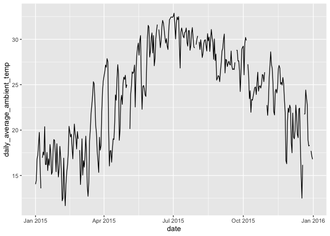

# Assignment 6: Data import and tidy data


First, load all the required packages with the following code. Install
them if they are not installed yet.

``` r
library(tidyverse)
library(knitr)
```

## **Exercise 1. Tibble and Data Import**

Import the data frames listed below into R and
[parse](https://r4ds.had.co.nz/data-import.html#parsing-a-vector) the
columns appropriately when needed. Watch out for the formatting oddities
of each dataset. Print the results directly, **without** using
`kable()`.

**You only need to finish any three out of the five questions in this
exercise in order to get credit.**

#### **1.1 Create the following tibble manually, first using `tribble()` and then using `tibble()`. Print both results. \[We didn’t have time to cover this in class, but look up how these functions work [here](https://r4ds.had.co.nz/tibbles.html#creating-tibbles)\]**

`tribble()`:

``` r
tribble(
  ~a, ~b, ~c, 
  #--|--|----
  1, 2.1, "apple", 
  2, 3.2, "orange"
)
```

    # A tibble: 2 × 3
          a     b c     
      <dbl> <dbl> <chr> 
    1     1   2.1 apple 
    2     2   3.2 orange

`tibble()`:

``` r
tibble(
  a = c(1, 2), 
  b = c(2.1, 3.2), 
  c = c("apple", "orange")
)
```

    # A tibble: 2 × 3
          a     b c     
      <dbl> <dbl> <chr> 
    1     1   2.1 apple 
    2     2   3.2 orange

#### **1.2 Import `https://raw.githubusercontent.com/nt246/NTRES-6100-data-science/master/datasets/dataset2.txt` into R. Change the column names into “Name”, “Weight”, “Price”.**

``` r
dataset2 <- read.csv("https://raw.githubusercontent.com/nt246/NTRES-6100-data-science/master/datasets/dataset2.txt", header = FALSE)

dataset2 <- dataset2 |>
  rename(Name = V1, Weight = V2, Price = V3)

as_tibble(dataset2)
```

    # A tibble: 3 × 3
      Name   Weight Price
      <chr>   <int> <dbl>
    1 apple       1   2.9
    2 orange      2   4.9
    3 durian     10  19.9

#### **1.3 Import `https://raw.githubusercontent.com/nt246/NTRES-6100-data-science/master/datasets/dataset3.txt` into R. Watch out for the first few lines, missing values, separators, quotation marks, and deliminaters.**

``` r
dataset3 <- read.csv("https://raw.githubusercontent.com/nt246/NTRES-6100-data-science/master/datasets/dataset3.txt")

dataset3 <- read_delim("https://raw.githubusercontent.com/nt246/NTRES-6100-data-science/master/datasets/dataset3.txt", skip=2, delim=";", quote ="/", na = c("?", "Not Available"))

as_tibble(dataset3)
```

    # A tibble: 3 × 3
      Name   Weight Price
      <chr>   <dbl> <dbl>
    1 apple       1   2.9
    2 orange      2  NA  
    3 durian     NA  19.9

#### **1.4 Import `https://raw.githubusercontent.com/nt246/NTRES-6100-data-science/master/datasets/dataset4.txt` into R. Watch out for comments, units, and decimal marks (which are `,` in this case).**

I did not do this exercise.

#### **1.5 Import `https://raw.githubusercontent.com/nt246/NTRES-6100-data-science/master/datasets/dataset5.txt` into R. Parse the columns properly. As a reminder, you can read about parsing date and time data [here](https://r4ds.had.co.nz/data-import.html#readr-datetimes). Write this imported and parsed data frame into a new csv file named `dataset5_new.csv` in your `problem_sets` folder.**

I did not do this exercise.

## **Exercise 2. Weather station**

This dataset contains the weather and air quality data collected by a
weather station in Taiwan. It was obtained from the Environmental
Protection Administration, Executive Yuan, R.O.C. (Taiwan).

#### **2.1 Variable descriptions**

- The text file
  `https://raw.githubusercontent.com/nt246/NTRES-6100-data-science/master/datasets/2015y_Weather_Station_notes.txt`
  contains descriptions of different variables collected by the station.

- Import it into R and print it in a table as shown below with
  `kable()`.

``` r
weather <- read.csv("https://raw.githubusercontent.com/nt246/NTRES-6100-data-science/master/datasets/2015y_Weather_Station_notes.txt")

weather <- read_delim("https://raw.githubusercontent.com/nt246/NTRES-6100-data-science/master/datasets/2015y_Weather_Station_notes.txt", delim="-", show_col_types = FALSE)

kable(weather)
```

| Item | Unit | Description |
|:---|:---|:---|
| AMB_TEMP | Celsius | Ambient air temperature |
| CO | ppm | Carbon monoxide |
| NO | ppb | Nitric oxide |
| NO2 | ppb | Nitrogen dioxide |
| NOx | ppb | Nitrogen oxides |
| O3 | ppb | Ozone |
| PM10 | μg/m3 | Particulate matter with a diameter between 2.5 and 10 μm |
| PM2.5 | μg/m3 | Particulate matter with a diameter of 2.5 μm or less |
| RAINFALL | mm | Rainfall |
| RH | % | Relative humidity |
| SO2 | ppb | Sulfur dioxide |
| WD_HR | degress | Wind direction (The average of hour) |
| WIND_DIREC | degress | Wind direction (The average of last ten minutes per hour) |
| WIND_SPEED | m/sec | Wind speed (The average of last ten minutes per hour) |
| WS_HR | m/sec | Wind speed (The average of hour) |

`#` indicates invalid value by equipment inspection  
`*` indicates invalid value by program inspection  
`x` indicates invalid value by human inspection  
`NR` indicates no rainfall  
blank indicates no data

#### **2.2 Data tidying**

- Import
  `https://raw.githubusercontent.com/nt246/NTRES-6100-data-science/master/datasets/2015y_Weather_Station.csv`
  into R. As you can see, this dataset is a classic example of untidy
  data: values of a variable (i.e. hour of the day) are stored as column
  names; variable names are stored in the `item` column.

- Clean this dataset up and restructure it into a tidy format.

- Parse the `date` variable into date format and parse `hour` into time.

- Turn all invalid values into `NA` and turn `NR` in rainfall into `0`.

- Parse all values into numbers.

- Show the first 6 rows and 10 columns of this cleaned dataset, as shown
  below, *without* using `kable()`.

*Hints: you don’t have to perform these tasks in the given order; also,
warning messages are not necessarily signs of trouble.*

``` r
library(lubridate)

weather2 <- read_csv("https://raw.githubusercontent.com/nt246/NTRES-6100-data-science/master/datasets/2015y_Weather_Station.csv", col_types = cols(.default = "c")) 
```

Before cleaning:

``` r
weather2 |>
  head(n = 6) |>
  select(1:10)
```

    # A tibble: 6 × 10
      date       station item     `00`  `01`  `02`  `03`  `04`  `05`  `06` 
      <chr>      <chr>   <chr>    <chr> <chr> <chr> <chr> <chr> <chr> <chr>
    1 2015/01/01 Cailiao AMB_TEMP 16    16    15    15    15    14    14   
    2 2015/01/01 Cailiao CO       0.74  0.7   0.66  0.61  0.51  0.51  0.51 
    3 2015/01/01 Cailiao NO       1     0.8   1.1   1.7   2     1.7   1.9  
    4 2015/01/01 Cailiao NO2      15    13    13    12    11    13    13   
    5 2015/01/01 Cailiao NOx      16    14    14    13    13    15    15   
    6 2015/01/01 Cailiao O3       35    36    35    34    34    32    30   

After cleaning:

``` r
weather2_new <- weather2 |> 
  pivot_longer(cols = c("00","01","02","03","04","05","06","07","08","09","10","11","12","13","14","15","16","17","18","19","20","21","22","23"), names_to = "hour") |>
  pivot_wider(values_from = value, names_from = item) |>
  mutate(RAINFALL = if_else(RAINFALL == "NR", "0", RAINFALL)) |>
  mutate(date = parse_date(date, format = "%Y/%m/%d")) |>
  mutate(hour = parse_time(hour, format = "%H")) |> 
  mutate(across(c(4:18), as.numeric))
```

``` r
weather2_new |>
  head(n = 6) |>
  select(1:10)
```

    # A tibble: 6 × 10
      date       station hour   AMB_TEMP    CO    NO   NO2   NOx    O3  PM10
      <date>     <chr>   <time>    <dbl> <dbl> <dbl> <dbl> <dbl> <dbl> <dbl>
    1 2015-01-01 Cailiao 00:00        16  0.74   1      15    16    35   171
    2 2015-01-01 Cailiao 01:00        16  0.7    0.8    13    14    36   174
    3 2015-01-01 Cailiao 02:00        15  0.66   1.1    13    14    35   160
    4 2015-01-01 Cailiao 03:00        15  0.61   1.7    12    13    34   142
    5 2015-01-01 Cailiao 04:00        15  0.51   2      11    13    34   123
    6 2015-01-01 Cailiao 05:00        14  0.51   1.7    13    15    32   110

#### **2.3 Using this cleaned dataset, plot the daily variation in ambient temperature on September 25, 2015, as shown below.**

``` r
weather2_new |> 
  filter(date == "2015-09-25") |> 
  ggplot() + 
  geom_line(aes(x = hour, y = AMB_TEMP))
```


#### **2.4 Plot the daily average ambient temperature throughout the year with a continuous line, as shown below.**

``` r
weather2_new |>
  group_by(date) |>
  summarize(daily_average_ambient_temp = mean(AMB_TEMP)) |> 
  ggplot() + 
  geom_line(aes(x = date, y = daily_average_ambient_temp))
```



#### **2.5 Plot the total rainfall per month in a bar chart, as shown below.**

*Hint: separating date into three columns might be helpful.*

``` r
weather2_new |>
  separate(date, into = c("year", "month", "day"), sep = "-") |> 
  group_by(month) |> 
  summarize(MonthlyRainfall = sum(RAINFALL, na.rm = TRUE)) |> 
  ggplot() + 
  geom_bar(aes(x = month, y = MonthlyRainfall), stat = "identity")
```


#### **2.6 Plot the per hour variation in PM2.5 in the first week of September with a continuous line, as shown below.**

*Hint: uniting the date and hour and parsing the new variable might be
helpful.*

``` r
unite(weather2_new, time, date, hour, sep=" ") |>
  mutate(time = parse_datetime(time)) |>
  filter(time <= parse_datetime("2015-09-08"),
         time >= parse_datetime("2015-09-01"), !is.na(PM2.5)) |>
  ggplot(aes(x = time, y = PM2.5))+
  geom_line()
```


## **Exercise 3. Camera data (OPTIONAL)**

This dataset contains information on 1038 camera models. It was obtained
from the following website:
<https://perso.telecom-paristech.fr/eagan/class/igr204/>

#### **3.1 Split brand names and model names**

- Import
  `https://raw.githubusercontent.com/nt246/NTRES-6100-data-science/master/datasets/camera.csv`
  to R.

- You will see that the `Model` columns contains both the brand names
  and model names of cameras. Split this column into two, one with brand
  name, and the other with model name, as shown below.

- Print the first 6 rows of the new data frame with `kable()`.

*Hint: check the merge argument in `separate()`*

``` r
cameras <- read_csv("https://raw.githubusercontent.com/nt246/NTRES-6100-data-science/master/datasets/camera.csv") 

cameras_new <- cameras |> 
  separate(col = Model, 
           into = c("Brand", "Model"), 
           sep = " ", 
           extra = "merge", 
           fill = "right")
kable(head(cameras_new))
```

| Brand | Model | Release date | Max resolution | Low resolution | Effective pixels | Zoom wide (W) | Zoom tele (T) | Normal focus range | Macro focus range | Storage included | Weight (inc. batteries) | Dimensions | Price |
|:---|:---|---:|---:|---:|---:|---:|---:|---:|---:|---:|---:|---:|---:|
| Agfa | ePhoto 1280 | 1997 | 1024 | 640 | 0 | 38 | 114 | 70 | 40 | 4 | 420 | 95 | 179 |
| Agfa | ePhoto 1680 | 1998 | 1280 | 640 | 1 | 38 | 114 | 50 | 0 | 4 | 420 | 158 | 179 |
| Agfa | ePhoto CL18 | 2000 | 640 | 0 | 0 | 45 | 45 | 0 | 0 | 2 | 0 | 0 | 179 |
| Agfa | ePhoto CL30 | 1999 | 1152 | 640 | 0 | 35 | 35 | 0 | 0 | 4 | 0 | 0 | 269 |
| Agfa | ePhoto CL30 Clik! | 1999 | 1152 | 640 | 0 | 43 | 43 | 50 | 0 | 40 | 300 | 128 | 1299 |
| Agfa | ePhoto CL45 | 2001 | 1600 | 640 | 1 | 51 | 51 | 50 | 20 | 8 | 270 | 119 | 179 |

#### **3.2 Split product line names and model names**

- Many model names start with a name for the product line, which is then
  followed by a name for the particular model.

- Select all Canon cameras, and further split the model names into
  product line names (in this case, they are either “Powershot” or
  “EOS”) and model names.

- Show the first 6 lines of this new data frame with `kable()`.

*Hint: notice that there are more than one possible separators.*

``` r
cameras_new2 <- cameras_new |>
  separate(col = Model, 
           into = c("Line", "Model"), 
           sep = " ", 
           extra = "merge", 
           fill = "right")
kable(head(cameras_new2))
```

| Brand | Line | Model | Release date | Max resolution | Low resolution | Effective pixels | Zoom wide (W) | Zoom tele (T) | Normal focus range | Macro focus range | Storage included | Weight (inc. batteries) | Dimensions | Price |
|:---|:---|:---|---:|---:|---:|---:|---:|---:|---:|---:|---:|---:|---:|---:|
| Agfa | ePhoto | 1280 | 1997 | 1024 | 640 | 0 | 38 | 114 | 70 | 40 | 4 | 420 | 95 | 179 |
| Agfa | ePhoto | 1680 | 1998 | 1280 | 640 | 1 | 38 | 114 | 50 | 0 | 4 | 420 | 158 | 179 |
| Agfa | ePhoto | CL18 | 2000 | 640 | 0 | 0 | 45 | 45 | 0 | 0 | 2 | 0 | 0 | 179 |
| Agfa | ePhoto | CL30 | 1999 | 1152 | 640 | 0 | 35 | 35 | 0 | 0 | 4 | 0 | 0 | 269 |
| Agfa | ePhoto | CL30 Clik! | 1999 | 1152 | 640 | 0 | 43 | 43 | 50 | 0 | 40 | 300 | 128 | 1299 |
| Agfa | ePhoto | CL45 | 2001 | 1600 | 640 | 1 | 51 | 51 | 50 | 20 | 8 | 270 | 119 | 179 |
