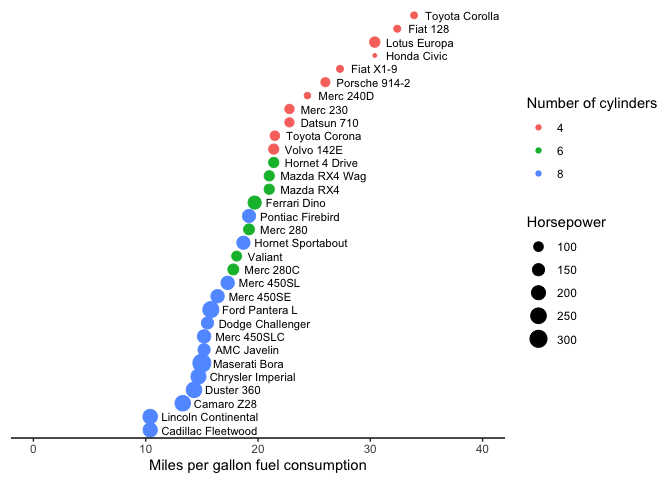

# Assignment 9: Functions and factors


To start, first load all the required packages with the following code.
Install them if they are not installed yet.

``` r
library(tidyverse)
library(knitr)
```

**Acknowledgements:** Exercises 1 and 2 were adapted (with permission)
from Iain Carmichael’s course [STOR 390: Introduction to Data
Science](https://idc9.github.io/stor390/#course_material).

## **Exercise 1: Unit converter**

**1.1 Write a function that can convert Fahrenheit to Celsius**, based
on the following formula: `C = (F - 32) * 5 / 9`

Take your function for a spin, does it return the correct values?

``` r
f_to_c <- function(fahrenheit) {
  celsius <- (fahrenheit - 32) * 5/9
  return(celsius)
}
```

32 F = 0 C

``` r
f_to_c(32)
```

    [1] 0

50 F = 10 C

``` r
f_to_c(50)
```

    [1] 10

212 F = 100 C

``` r
f_to_c(212)
```

    [1] 100

**1.2** A student came from ‘tropical Canada’. She doesn’t like the cold
but she really didn’t like it when it’s hot. Although she wanted to know
what the temperature is in Celsius when the US weather channel reported
it in Fahrenheit, there are certain points at which it was just too cold
or too hot for to to care about the exact value. **Modify the f_to_c
function below to print the following**, and check if your function
works properly using the input of **-10 F, 60 F, and 90 F**.

- If the temperature is less than -20 C, print “Don’t bother going out.”

- If the temperature is greater than 30 C, print “I’m moving back to
  Canada.”

- If the temperature is between -20 C and 30 C, print the temperature in
  Celsius.

``` r
f_to_c_message <- function(fahrenheit) {
  celsius <- (fahrenheit - 32) * 5/9
  if (celsius < -20) {
    return("Don't bother going out.")
  } else if (celsius > 30) {
    return("I'm moving back to Canada.")
  } else {
    return(celsius)
  }
}
```

``` r
f_to_c_message(-10)
```

    [1] "Don't bother going out."

``` r
f_to_c_message(60)
```

    [1] 15.55556

``` r
f_to_c_message(90)
```

    [1] "I'm moving back to Canada."

## **Exercise 2: Set operation**

The R function `setdiff(x,y)` returns the elements of a vector x that
are not in y. For example, say x is a list of singers who can reach very
high registers, and y is a list of musicians who died in 2016.
`setdiff(x, y)` would return a list of singers with high voices who did
not die in 2016.

``` r
x <- c("prince", "mj", "sam cook", "whitney", "dolly")
y <- c("sharon jones", "prince", "bowie", "leonard cohen", "phife dawg")
setdiff(x,y)
```

    [1] "mj"       "sam cook" "whitney"  "dolly"   

However, sometimes you want a function to return the elements that are
in x or y but not both. Here, **write such a function**, and use your
custom function to **find the names of singers who either have high
voices, but did not die in 2016, OR who died in 2016 but do not have
high voices.**

Your function will need to work for any vectors, not just the ones in
this example. The output should be a single vector, not two vectors.

**Hint**: you will need R’s [set
operations](https://stat.ethz.ch/R-manual/R-devel/library/base/html/sets.html).

``` r
unique_element <- function(x, y) {
  only_in_x <- setdiff(x, y)
  only_in_y <- setdiff(y, x)
  result <- c(only_in_x, only_in_y)
  return(result)
}
```

``` r
# Example output
unique_element(x,y)
```

    [1] "mj"            "sam cook"      "whitney"       "dolly"        
    [5] "sharon jones"  "bowie"         "leonard cohen" "phife dawg"   

## **Exercise 3: Fuel Efficiency of Car Models**

This exercise uses the `mtcars` dataset, which is available in base R.
It was extracted from the 1974 Motor Trend US magazine, and comprises
fuel consumption and 10 aspects of automobile design and performance for
32 automobiles (1973–74 models). Let’s first convert `mtcars` to tibble
format such that the row names become a column named “model”.

``` r
mtcars_tbl <- as_tibble(mtcars, rownames = "model")
mtcars_tbl %>%
  head() %>%
  kable()
```

| model             |  mpg | cyl | disp |  hp | drat |    wt |  qsec |  vs |  am | gear | carb |
|:------------------|-----:|----:|-----:|----:|-----:|------:|------:|----:|----:|-----:|-----:|
| Mazda RX4         | 21.0 |   6 |  160 | 110 | 3.90 | 2.620 | 16.46 |   0 |   1 |    4 |    4 |
| Mazda RX4 Wag     | 21.0 |   6 |  160 | 110 | 3.90 | 2.875 | 17.02 |   0 |   1 |    4 |    4 |
| Datsun 710        | 22.8 |   4 |  108 |  93 | 3.85 | 2.320 | 18.61 |   1 |   1 |    4 |    1 |
| Hornet 4 Drive    | 21.4 |   6 |  258 | 110 | 3.08 | 3.215 | 19.44 |   1 |   0 |    3 |    1 |
| Hornet Sportabout | 18.7 |   8 |  360 | 175 | 3.15 | 3.440 | 17.02 |   0 |   0 |    3 |    2 |
| Valiant           | 18.1 |   6 |  225 | 105 | 2.76 | 3.460 | 20.22 |   1 |   0 |    3 |    1 |

From `mtcars_tbl`, reproduce the following plot, which shows the miles
per gallon (`mpg`) of car models on the x axis (see hints below).
Different models are ordered on the y axis according to their `mpg` and
their names are shown next to the data points. Also, the size of each
data point maps to its horse power (`hp`), and the color maps to number
of cylinders (`cyl`).

**Hints:**

- Start by reordering the factor levels of the `model` column based on
  values in the `mpg` column.

- You may also need to convert `cyl` first into a character variable
  (`as.character()`) or a factor (`factor` or `as_factor()`), and then
  (re)set its factor levels.

- When making the plot, please pay attention to the following elements
  of the plot that need to be specified.

  - Horizontal adjustment of the text labels (“`hjust`” option in
    `geom_text()`)

  - The range of the x-axis (`xlim()`)

  - x-axis label and legend titles (`labs()`)

  - The preset theme (`theme_*()`)

  - The removal of the y-axis (`theme()`)

``` r
library(forcats)

mtcars_tbl <- mtcars_tbl |>
  mutate(model = fct_reorder(model, mpg), cyl = as.factor(cyl)) |>
  ggplot(aes(x = mpg, y = model, size = hp, color = cyl)) +
  geom_point() + 
  xlim(0, 40) + 
  labs(x = "Miles per gallon fuel consumption", color = "Number of cylinders", size = "Horsepower") +
  geom_text(aes(label = model), hjust = 0, nudge_x = 1, size = 3, color = "black")  + 
  theme_classic() + 
  theme(axis.line.y = element_blank(), axis.text.y = element_blank(), axis.ticks.y = element_blank(), axis.title.y = element_blank())

mtcars_tbl
```



#### **Reflection Questions:**

#### **In this assignment, you wrote functions that operate on vectors (Exercises 1 and 2) and manipulated a data frame to create a plot (Exercise 3). Explain the difference between a simple character vector (like the one for singers) and a factor (like the model column). Why was it necessary to treat the model column as a factor and reorder its levels to create the final plot?**

A character vector is just a string of text, while a factor is a
categorical variable with separate levels (or categories). The model
column had to be treated as a factor because we wanted to order the cars
based on their miles per gallon, and a text string can’t be reordered.

#### **Identify one of the three exercises where you used an AI assistant to help generate or debug a chunk of code. Provide the specific prompt you used. Then, show the code before you finalized it (e.g., the AI’s initial suggestion or your first attempt) and the final, working code. In your commentary, explain what was missing or incorrect in the “before” version and what you learned by testing and correcting it to produce the final version.**

I didn’t use a separate AI chatbot for this assignment. However, through
the course we had installed GitHub Copilot, which did automatically
provide suggestions for some of the above questions before I had even
begun to type my code. Specifically for Exercise 2, Copilot suggested
the entire code correctly before I had even finished reading the
question! I found this helpful in that I was able to learn backwards,
looking at Copilot’s code and trying to figure out how Copilot created
it. However, I was also quite frustrated—I had wanted to try to come to
the answer myself!
